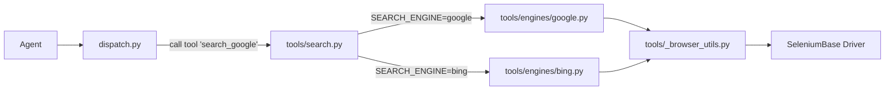

# Pluggable Search Engine Refactor

Surgical reshape of [`tools/search_google.py`](tools/search_google.py) into three small pieces:

1. **Engine-agnostic browser helpers** — extracted out, so every engine reuses the same stealth/typing logic.
2. **Per-engine search modules** — each just exposes `search(driver, query) -> list[dict]`. Add Google (current logic) and Bing (new).
3. **Tiny dispatcher** — picks the engine based on `SEARCH_ENGINE` env var (default `google`).

Tool name `search_google` is kept everywhere user-facing (JSON, prompt, fixtures, tests, dispatch tool key). Only the implementation behind it changes.

## File structure after refactor

```
tools/
  _browser_utils.py        # NEW: stealth_open, human_type, typo helpers, cluster helpers, QWERTY map
  search.py                # NEW: facade — picks engine via SEARCH_ENGINE env var
  search_google.json       # UNCHANGED — agent still calls "search_google"
  engines/
    __init__.py            # NEW: empty
    google.py              # NEW: current search_google() logic minus shared helpers
    bing.py                # NEW: equivalent for bing.com
  search_google.py         # DELETED
  get_page_content.py      # untouched
  get_page_content.json    # untouched
  blocklist.py             # untouched
  registry.py              # untouched
```



## Changes per file

### NEW [`tools/_browser_utils.py`](tools/_browser_utils.py)

Move these from [`tools/search_google.py`](tools/search_google.py) verbatim, drop the leading `_` from the public ones:

- `stealth_open(driver, url)` — uses `STEALTH_RECONNECT_TIME`
- `human_type(driver, selector, text)` — uses `TYPING_WPM`
- `typo_char(ch)`, `_new_cluster_speed()`, `_new_cluster_size()`
- Constants: `_CHARS_PER_WORD`, `_TYPING_SPEED_BUFF`, `_TYPO_RATE`, `_CLUSTER_SIZE_MIN/MAX`, `_CLUSTER_PAUSE_MULT_MIN/MAX`, `_QWERTY_NEIGHBORS`

No behavior change — same env vars, same constants, same logic.

### NEW [`tools/engines/google.py`](tools/engines/google.py)

The current Google logic, with shared helpers imported from `_browser_utils`:

```python
from tools._browser_utils import stealth_open, human_type

def search(driver, query: str) -> list[dict]:
    """Search Google and return up to 5 organic results."""
    # current search_google() body, with _stealth_open -> stealth_open and
    # _human_type used inside _type_query -> human_type
    ...
```

Keeps `_wait_for_results`, `_type_query`, `_dismiss_consent`, `_parse_results`, `_parse_results_fallback`, `_get_snippet` as private module-level helpers (Google-specific DOM selectors).

### NEW [`tools/engines/bing.py`](tools/engines/bing.py)

Same shape as Google but Bing-specific:

```python
from urllib.parse import quote_plus
from tools._browser_utils import stealth_open, human_type

_RESULT_WAIT = 4

def search(driver, query: str) -> list[dict]:
    try:
        stealth_open(driver, "https://www.bing.com/")
        if driver.is_element_present("input[name='q']"):
            human_type(driver, "input[name='q']", query)
        else:
            stealth_open(driver, f"https://www.bing.com/search?q={quote_plus(query)}")
        _wait_for_results(driver)
        results = _parse_results(driver)
        return results if results else [{"error": "No results found"}]
    except Exception as exc:
        return [{"error": f"search_bing failed: {exc}"}]
```

Bing DOM selectors:
- Result container: `li.b_algo`
- Title + link: `h2 > a` inside the container
- Snippet: `.b_caption p`

### NEW [`tools/search.py`](tools/search.py)

Tiny dispatcher — one import, one map, one function:

```python
import os
from tools.engines import google, bing

_ENGINES = {
    "google": google.search,
    "bing": bing.search,
}

def search(driver, query: str) -> list[dict]:
    name = os.environ.get("SEARCH_ENGINE", "google").strip().lower()
    fn = _ENGINES.get(name)
    if fn is None:
        return [{"error": f"Unknown SEARCH_ENGINE: {name!r}. Valid: {list(_ENGINES)}"}]
    return fn(driver, query)
```

### MODIFIED [`dispatch.py`](dispatch.py)

One-line change:

```python
from tools.search import search          # was: from tools.search_google import search_google
...
"search_google": lambda args: search(driver, args["query"]),  # was: search_google(driver, ...)
```

### DELETED [`tools/search_google.py`](tools/search_google.py)

All logic now lives in `_browser_utils.py` + `engines/google.py`. No other Python file imports it (verified: only `dispatch.py`, which is being updated).

### MODIFIED [`.env`](.env)

Append:

```
# Which search engine the search_google tool uses under the hood.
# Options: google (default) | bing
SEARCH_ENGINE=google
```

### MODIFIED [`docs/README.md`](docs/README.md)

Add `SEARCH_ENGINE=google` to the example `.env` block, and one row in the Configuration table:

```
| `SEARCH_ENGINE` | Which engine the `search_google` tool actually uses under the hood. `google` (default) or `bing`. |
```

## What does NOT change

- Tool name `search_google` (in JSON, agent prompt, all 15 test fixtures).
- Tool JSON description.
- Test runner and all fixtures (mock dispatch never touches real engine code).
- All env vars added previously: `TOOL_CALL_DELAY`, `STEALTH_RECONNECT_TIME`, `TYPING_WPM`, `USER_AGENT` — they all still work via `_browser_utils.py`.
- `main.py`, `mcp_server.py`, `agent.py`.

## Why this shape

- "Something smaller, not an interface" — plain functions with the same signature `search(driver, query) -> list[dict]`. No ABCs, no classes, no registry magic. Adding a new engine = drop one file in `tools/engines/` and add it to the dispatcher map.
- Shared helpers live in one place, so all engines automatically benefit from the stealth open + human typing knobs.
- Tool name kept stable per your choice, so prompt and tests don't need touching.
- Default `SEARCH_ENGINE=google` means zero behavior change unless explicitly flipped.
